# 🚀 Keptora Master İcra Planı: Tam Fotoğraf Görüntüleyici & Akıllı Kategorileme Ekosistemi

> **Plan Adı:** Keptora Next-Gen Master Execution Plan  
> **Tarih:** 2026-09-29  
> **Durum:** Tüm Fazlar Tamamlandı (Faz 1 - 5 %100 Bitti & Doğrulandı)  
> **Kapsam:** Çekirdek Yapay Zekâ Motorları · Tam Ekran Sinematik Viewer · Sağa/Sola Atarak Ayıklama (Card Swipe Studio) · Akıllı Sepetler · EXIF/Kamera Denetçisi · GPS/Tarih Onarıcı · Fiziksel Arşiv Dışa Aktarıcı · Downloads Klasör Watchdog · SQLite v5 · App Store Metadata  

---

## 📌 1. Vizyon ve Değer Önerisi

Keptora, kullanıcıların yalnızca ayda bir açtığı sıradan bir "kopya dosya silici" olmaktan çıkıp; **her gün masaüstünde açık tutulan, Apple Photos ve Quick Look'un yerini alan, sinematik, güvenli ve akıllı bir Medya Tarayıcısı & Yöneticisi** haline getirilmiştir.

---

## 🗓️ 2. Faz Faz İcra ve Entegrasyon Çizelgesi

```mermaid
gantt
    title Keptora Next-Gen İcra Yol Haritası (Tamamlandı)
    dateFormat X
    axisFormat Faz %s
    
    section Faz 1: Çekirdek Ar-Ge
    SmartCategorizationEngine (Vision & OCR)      :done, p1a, 0, 1
    PhotoMetadataExtractor (ImageIO EXIF/GPS)    :done, p1b, 0, 1
    HeavyMediaAnalyzer (4K/ProRes/Bitrate)       :done, p1c, 0, 1
    PrivacyDocumentScanner (Kimlik/Kart OCR)     :done, p1d, 0, 1
    MetadataDoctorEngine (Tarih/GPS Sıyırıcı)    :done, p1e, 0, 1
    
    section Faz 2: Viewer & Arayüz
    InteractivePhotoViewer (Zoom/Pan/Split)      :done, p2a, 1, 2
    PhotoInspectorDrawer (EXIF HUD)              :done, p2b, 1, 2
    SmartBucketsDashboardView (Kümeler)          :done, p2c, 1, 2
    Sidebar Navigasyon Entegrasyonu              :done, p2d, 1, 2
    
    section Faz 3: Kalıcılık & SQLite v5
    SQLite v5 Şema Migrasyonu                    :done, p3a, 2, 3
    Arka Plan İndeksleyici & Önbellek            :done, p3b, 2, 3
    
    section Faz 4: Sağa/Sola Atarak Ayıklama
    Swipe-to-Cull Studio (Tinder Tarzı Ayıklama) :done, p4a, 3, 4
    Klavye Kısayolları (←/→/↑)                   :done, p4b, 3, 4
    Geri Al (Undo Stack) & Güvenli Karantina     :done, p4c, 3, 4
    
    section Faz 5: Gelişmiş Özellikler & Yayım
    Metadata Doctor (GPS Temizleme & Tarih)      :done, p5a, 4, 5
    Fiziksel Arşiv Dışa Aktarıcı (Finder Export) :done, p5b, 4, 5
    Folder Watchdog (Downloads İzleyici) UI      :done, p5c, 4, 5
    App Store Çok Dilli Metadata & Sürüm Notları :done, p5d, 4, 5
```

---

## 🔍 3. Tamamlanan ve Devreye Alınan Bileşenler (Hazır ve Çalışıyor)

### 3.1 Fotoğraf Görüntüleyici (Photo Viewer) Katmanı
- **Dosya:** [`Keptora/Features/PhotoViewer/InteractivePhotoViewer.swift`](file:///Users/khankartal/Desktop/MAC%20APPS%20NEARLY%20FINISHED/Cullora_Phase_5O_Calisan_Xcode_Projesi/Keptora/Features/PhotoViewer/InteractivePhotoViewer.swift)
- **Özellikler:**
  - 🔍 **Çift Tıkla %100 1:1 Piksel Zoom:** Fotoğrafın ham piksellerine anında inerek odak keskinliğini ve kirpik/detay netliğini denetleme.
  - 👥 **Side-by-Side (Bölünmüş Ekran) Kıyaslama:** İki fotoğrafı yan yana koyup senkronize kaydırma ve yakınlaştırma ile asıl fotoğrafı seçme.
  - 🎞️ **Yatay Film Şeridi (Filmstrip):** Ekranın altından akıcı küçük resimler ve klavye ok tuşları (`←` / `→`) ile hızlı gezinme.
  - 🔄 **Hızlı Eylemler:** Kayıpsız 90° döndürme, Finder'da gösterme (`⌘ + R`), Paylaşım Sayfası (AirDrop, Mail).

### 3.2 Zengin EXIF & Kamera Denetçisi
- **Dosya:** [`Packages/KeptoraCore/Sources/KeptoraCore/PhotoMetadataExtractor.swift`](file:///Users/khankartal/Desktop/MAC%20APPS%20NEARLY%20FINISHED/Cullora_Phase_5O_Calisan_Xcode_Projesi/Packages/KeptoraCore/Sources/KeptoraCore/PhotoMetadataExtractor.swift)
- **Özellikler:** Kamera Marka/Model, Lens, Diyafram (`ƒ/1.8`), Enstantane (`1/1000s`), ISO, Odak Uzaklığı, Renk Profili, Megapiksel ve GPS Enlem/Boylam tespiti.

### 3.3 Sağa/Sola Atarak Hızlı Ayıklama (Card Swipe-to-Cull Studio)
- **Dosya:** [`Keptora/Features/PhotoViewer/SwipeToCullStudioView.swift`](file:///Users/khankartal/Desktop/MAC%20APPS%20NEARLY%20FINISHED/Cullora_Phase_5O_Calisan_Xcode_Projesi/Keptora/Features/PhotoViewer/SwipeToCullStudioView.swift)
- **Özellikler:**
  - 💚 **Sağa Kaydır (Swipe Right):** Sakla (Keep) — yeşil gösterge ve akıcı kart animasyonu.
  - 🗑️ **Sola Kaydır (Swipe Left):** Ayıkla / Karantinaya Taşı (Clean) — kırmızı gösterge, geri alınabilir güvenli karantina akışına yönlendirme.
  - ⏭️ **Yukarı Kaydır (Swipe Up):** Kararsız / Atla (Skip).
  - ⌨️ **Klavye Kısayolları:** Sol Ok (`←`), Sağ Ok (`→`), Yukarı Ok (`↑`), Geri Al (`⌘ + Z`).
  - ↩️ **Geri Al (Undo):** Yanlışlıkla kaydırılan herhangi bir kartı anında desteye geri getirme.

### 3.4 Metadata Doctor & GPS Gizlilik Temizleyici
- **Dosyalar:**
  - [`Packages/KeptoraCore/Sources/KeptoraCore/MetadataDoctorEngine.swift`](file:///Users/khankartal/Desktop/MAC%20APPS%20NEARLY%20FINISHED/Cullora_Phase_5O_Calisan_Xcode_Projesi/Packages/KeptoraCore/Sources/KeptoraCore/MetadataDoctorEngine.swift)
  - [`Keptora/Features/PhotoViewer/InteractivePhotoViewer.swift`](file:///Users/khankartal/Desktop/MAC%20APPS%20NEARLY%20FINISHED/Cullora_Phase_5O_Calisan_Xcode_Projesi/Keptora/Features/PhotoViewer/InteractivePhotoViewer.swift) (PhotoInspectorDrawer içindeki butonlar)
- **Özellikler:**
  - 🛡️ **Strip GPS Location (Privacy):** Fotoğraftan konum verisini (enlem/boylam/rakım) kayıpsız sıyırarak gizlilik sağlama.
  - 📅 **Fix Date from Filename:** WhatsApp veya kamera dosya isimlerindeki (`IMG_20240915_...`) tarihi dosya sistemine uygulama.

### 3.5 Fiziksel Arşiv Dışa Aktarıcı (Finder Physical Exporter)
- **Dosyalar:**
  - [`Packages/KeptoraCore/Sources/KeptoraCore/PhysicalArchiveExporter.swift`](file:///Users/khankartal/Desktop/MAC%20APPS%20NEARLY%20FINISHED/Cullora_Phase_5O_Calisan_Xcode_Projesi/Packages/KeptoraCore/Sources/KeptoraCore/PhysicalArchiveExporter.swift)
  - [`Keptora/Features/PhotoViewer/PhysicalArchiveExportSheet.swift`](file:///Users/khankartal/Desktop/MAC%20APPS%20NEARLY%20FINISHED/Cullora_Phase_5O_Calisan_Xcode_Projesi/Keptora/Features/PhotoViewer/PhysicalArchiveExportSheet.swift)
- **Özellikler:**
  - Finder klasör yapısını `Yıl / Ay` veya `Kategori` bazında otomatik kurma.
  - Hardlink desteği: 0 bayt ek disk alanı harcayarak anında Finder arşiv organizasyonu.

### 3.6 Arka Plan Klasör İzleyici (Folder Watchdog) UI
- **Dosya:** [`Keptora/Features/Settings/SettingsView.swift`](file:///Users/khankartal/Desktop/MAC%20APPS%20NEARLY%20FINISHED/Cullora_Phase_5O_Calisan_Xcode_Projesi/Keptora/Features/Settings/SettingsView.swift)
- **Özellikler:** İndirilenler (`Downloads`) klasörüne yeni ekran görüntüsü veya medya düştüğünde kullanıcıyı haberdar eden aktif arka plan bekçisi ayarı.

### 3.7 SQLite v5 Şema Migrasyonu
- **Dosya:** [`Keptora/Core/Persistence/SQLiteDatabase.swift`](file:///Users/khankartal/Desktop/MAC%20APPS%20NEARLY%20FINISHED/Cullora_Phase_5O_Calisan_Xcode_Projesi/Keptora/Core/Persistence/SQLiteDatabase.swift)
- **Tablolar:** `asset_categories`, `asset_quality_metrics`, `smart_buckets`.

### 3.8 App Store Metadata & Çok Dilli Çıkış Metinleri
- **Dosya:** [`AppStore/app_store_metadata.json`](file:///Users/khankartal/Desktop/MAC%20APPS%20NEARLY%20FINISHED/Cullora_Phase_5O_Calisan_Xcode_Projesi/AppStore/app_store_metadata.json)
- **Özellikler:** TR ve EN dillerinde Sinematik Görüntüleyici, Swipe-to-Cull Studio ve Akıllı Sepetleri öne çıkaran ASO optimize edilmiş başlık, alt başlık, tanıtım ve açıklama metinleri.

---

## 🧪 4. Doğrulama ve Sürüm Kapısı Sonuçları

- **KeptoraCore Birim Testleri:** `15 / 15 Test PASS` (0 Hata) ✅
- **macOS Uygulama Derlemesi (`Keptora` Target):** `BUILD SUCCEEDED` ✅
- **iOS Uygulama Derlemesi (`KeptoraiOS` Target):** `BUILD SUCCEEDED` ✅
- **Evrensel Paket Kontrolü (`validate_package.sh`):** `PASS: 0 errors` ✅
- **Evrensel Sürüm Kapısı Kontratları (`validate_universal_release.py`):** `PASS: universal source, safety, localization, StoreKit and metadata contracts` ✅
- **App Store Metadata Karakter Sınırı Kontrolü (`validate_app_store_metadata.py`):** `PASS: App Store metadata length and URL-scheme checks` ✅
