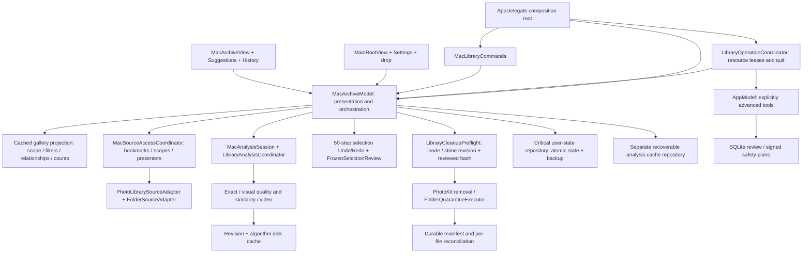

# Current unified library architecture

7 October 2026. Canonical scope: the current Photos / Suggestions / History product, with the advanced SQLite workflow identified separately. [Latest delivery and validation limits](MAC_REAUDIT_DELIVERY.md); [previous delivery](MAC_ARCHITECTURE_DELIVERY.md).

## Ownership

- **Composition:** one `MacArchiveModel` for the main app window, fallback AppKit window, Settings and commands. The advanced workflow has its own deliberate route; primary source/scan commands always target the unified session.
- **Presentation:** `MacArchiveView.swift` contains source setup, the grid, frozen review, Suggestions and History. Compact search, filters and scan controls remain above gallery scrolling. `MacArchiveModel.swift` coordinates services and publishes product state. Security access and native input bridges live in `MacLibraryServices.swift`. Cached projections supply scoped counts, per-item issues and relationship/keeper badges in both layouts; search uses a 120 ms debounce. Settings uses its native scene; error/paywall hosts follow the initiating presentation.
- **Source access:** retained security-scoped bookmarks, stable volume/file identity where available, source checkbox scope and folder observers. Resolving a moved bookmark revalidates physical identity before routing operations to the new URL. An unavailable source cannot be inferred from an empty scan.
- **Analysis:** a captured `LibraryConfiguration` is immutable for the pass. Default keeper policy preserves the analyzer's measured-quality recommendation; explicit user strategies and protection take priority. Sources publish cumulative 100-item batches with `enumerationComplete` coverage so pending selections survive loading. Control pauses between items and cancels cooperatively. A thread-safe checkpoint buffer captures worker emissions before quit flushes. Exact checkpoints are revision/source/network bound; visual descriptors are revision/algorithm cached. Refresh retains unchanged findings and rebinds routes.
- **Selection:** one basket across sources and filters. A bounded 50-step Undo/Redo history stores IDs and user keeper/protection decisions together; unavailable IDs cannot be reintroduced blindly. Native text editing keeps its own undo. App protection blocks manual and bulk selection until explicitly removed. Final review owns frozen assets and removal undo. Partial cleanup reports completed/failed/not-attempted IDs and requires explicit re-review of remaining items.
- **Cleanup:** file snapshots require physical identity and a nanosecond ctime revision; old snapshots require re-review. Preflight validates before/after hashing and binds known reviewed digests. Hard-link entries have distinct selection IDs and shared physical revision; confirmed own moves refresh sibling ctime while retaining the digest. PhotoKit rechecks the reviewed snapshot before mutation. Files save a manifest before moving and compensate on failure. Incomplete families need explicit consent. Restore hashes immediately before each move and at the resulting original before recording completion, with no overwrite. Corrupt recovery records are reported individually; completed receipts remain historical. Normal refresh reads metadata; History performs revision-cached verification.
- **Persistence:** the critical user-state document holds basket metadata, decisions, bookmarks/ticks, context and recovery receipts. A separate analysis-cache document holds assets, groups, quality, issue/stage identifiers and checkpoint. User-state writes debounce at 250 ms; dirty analysis writes are bounded to roughly once per second. Both repositories serialize atomic writes with sequence numbers and backup. A persistent health banner blocks new decisions/cleanup until critical state is repaired or saved; unreadable originals are preserved separately. Cache failure requests a new scan while preserving decisions. Photos receipts distinguish pending/failed/confirmed because an app crash cannot prove a system operation's outcome.
- **Lifecycle:** both Mac workflows share resource leases: concurrent reads are allowed; overlapping volume/Photos writers are exclusive. Parent/subfolder selections share a volume resource. Source/permission events queue during work. Deactivation saves without cancelling scans; sleep pauses. Quit prevents new work, awaits both workflows' tracked tasks and confirmed writers, captures the analysis tail and flushes. Failed critical saving cancels quit and exposes repair. Cancellation waits for worker completion before idle.
- **Diagnostics:** current-session aggregates only. No filenames, paths, source ID hashes, media bytes, raw errors or account identifiers. Cache counters are observed values, not performance promises.

File source boundaries use canonical relative paths, resolving existing ancestors before appending absent components. This handles macOS `/var` aliases and missing restore originals, permits identity-verified root rebasing, and rejects escaped symlink parents. Quarantine/restore use the same boundary rule.

## Injection and verification

The model accepts a repository URL, source access coordinator, cleanup preflight, folder executor, shared operation owner and explicit in-memory test mode. Portable tests inject real file replacement, mutation and hard links. Restore tests inject changes before/after moves and cancellation via executor hooks. The Mac fixture uses temporary folders and production APIs on JPEGs. Apple-only results cannot be inferred from portable execution. PhotoKit permission and iCloud behavior remain native acceptance.

`Scripts/validate_mac_localization.py` checks App/Feature controls, review/cleanup model text, mapped quality/keeper/error labels and cleanup errors in four languages. Image/format validators remain. Portable tests run on Linux; `.github/workflows/apple-validation.yml` selects Apple recovery, app and UI tests, including text/gallery Undo/Redo and Settings-only Pro. Workflow dispatch can set `benchmark_items=2000|3000`; a schedule applies once on the default branch. Benchmarks describe a generated corpus, not real-library precision, scrolling, energy or network speed. Real-library performance remains native acceptance.

## Legacy inventory

| Component | Current role |
|---|---|
| `AppModel`, SQLiteDatabase, ScanCoordinator, SimilarityCoordinator, QuarantineCoordinator | Reachable Advanced Tools and verified-copy safety-plan history. Their commands are explicitly advanced. No primary gallery command is routed here. |
| `HomeView`, `ReviewStudioView`, `ReviewInsightsView`, `HistoryView` | Advanced folder scan/review/insight and verified plans. Their SQLite metrics are scoped to that workflow. |
| `MacPhotosLibraryView` and old `SmartBucketsView` | Kept compatibility views; primary route switch uses the unified gallery and `MacSuggestionsView`. They are not current product entry points. |
| `InteractivePhotoViewer` / comparison components | Existing advanced inspector/viewer; no comparison, swipe or magnifier is added to the main cleanup flow. |
| `KeptoraLifecycleCoordinator` | Legacy epoch helper. Shared source/volume exclusion belongs to `LibraryOperationCoordinator`; workflow-specific state remains in each model. |
| `Docs/TECHNICAL_DESIGN.md`, `SCREEN_SPEC.md`, phase implementation reports | Historical Phase 5I scope. They do not describe the current unified product. |

The advanced SQLite engine remains a maintained separate workflow; this change does not claim a wholesale rewrite of legacy persistence or the entire iPhone store. Shared adapter changes include iPhone identity migration, late PhotoKit validation, family consent and rebased restoration so they do not regress mobile cleanup.
