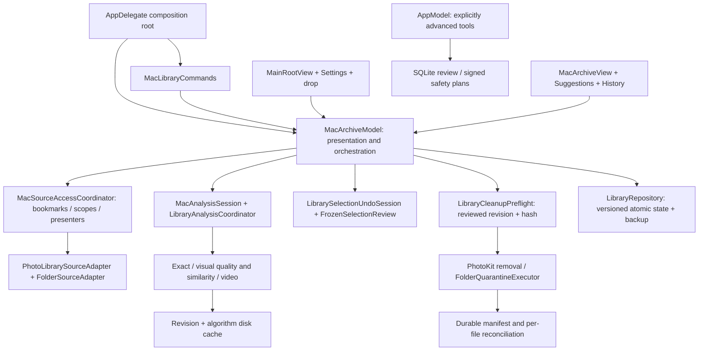

# Current unified library architecture

6 October 2026. Canonical scope: the current Photos / Suggestions / History product, with the advanced SQLite workflow identified separately. [Delivery and validation limits](MAC_ARCHITECTURE_DELIVERY.md).

## Ownership

- **Composition:** one `MacArchiveModel` for the main app window, fallback AppKit window, Settings and commands. The advanced workflow has its own deliberate route; primary source/scan commands always target the unified session.
- **Presentation:** `MacArchiveView.swift` contains source setup, the grid, frozen review, Suggestions and History. `MacArchiveModel.swift` coordinates services and publishes product state. Security access and native input bridges live in `MacLibraryServices.swift`.
- **Source access:** retained security-scoped bookmarks, stable volume/file identity where available, source checkbox scope and folder observers. Resolving a moved bookmark revalidates physical identity before routing operations to the new URL. An unavailable source cannot be inferred from an empty scan.
- **Analysis:** a captured `LibraryConfiguration` is immutable for the pass. The cooperative control suspends work between items and responds to cancellation. A thread-safe checkpoint buffer captures worker emissions before quit flushes. Exact fingerprint checkpoints are revision/source/network bound; visual descriptors are revision/algorithm cached. Main catalogue refresh retains unchanged findings and rebinds routes.
- **Selection:** one basket across sources and filters. One undo memento stores IDs and user keeper/protection decisions together; unavailable IDs cannot be reintroduced blindly. Final review owns frozen assets and its own removal undo.
- **Cleanup:** preflight validates before/after hash preparation. PhotoKit rechecks the reviewed snapshot immediately before its confirmed system mutation. File execution rechecks revisions and hashes, saves a manifest before moving, updates each file’s state, coordinates moves and compensates on failure. A same-basename incomplete family needs an explicit manual exception. Restore verifies identity/content and never overwrites an occupied original.
- **Persistence:** one Mac session document contains basket metadata, decisions, connected bookmarks/ticks, gallery context, recovery receipts, analysis snapshot and exact checkpoint. The actor serializes atomic writes, ignores stale sequence numbers, and keeps a valid backup. Corruption/writes are user-visible; legacy preferences/selection JSON are migration inputs. Native Photos receipts distinguish pending/failed/confirmed because an app crash cannot prove a system operation’s outcome.
- **Lifecycle:** loading, analysis and cleanup gates prohibit conflicting mutation. Source and authorization events queue during work. App deactivation saves state without cancelling the scan. Sleep pauses; quit waits for an already-confirmed cleanup, cancels analysis safely, captures its tail checkpoint and flushes.
- **Diagnostics:** current-session aggregates only. No filenames, paths, source ID hashes, media bytes, raw errors or account identifiers. Cache counters are observed values, not performance promises.

## Injection and verification

The model accepts a repository URL, source access coordinator, cleanup preflight and folder cleanup executor. The shared preflight accepts a revision validator and any `SourceAdapter`; portable tests inject a real file mutation during hashing. The Mac fixture injects owned temporary folders, then uses production enumeration/analysis/cleanup/restore APIs on actual JPEGs. PhotoKit permission and iCloud behavior remain native acceptance, not fabricated fixture results.

`Scripts/validate_mac_localization.py` checks fixed App/Feature control strings and cleanup errors. Existing image/format validators remain. Portable tests run on Linux; Apple recovery, native app tests and UI tests are selected by `.github/workflows/apple-validation.yml`. Workflow dispatch can set `benchmark_items=2000|3000`; a schedule applies once this workflow is on the default branch. Benchmark artifacts describe a generated local corpus and do not certify real-library precision, scrolling, energy or network speed.

## Legacy inventory

| Component | Current role |
|---|---|
| `AppModel`, SQLiteDatabase, ScanCoordinator, SimilarityCoordinator, QuarantineCoordinator | Reachable Advanced Tools and verified-copy safety-plan history. Their commands are explicitly advanced. No primary gallery command is routed here. |
| `HomeView`, `ReviewStudioView`, `ReviewInsightsView`, `HistoryView` | Advanced folder scan/review/insight and verified plans. Their SQLite metrics are scoped to that workflow. |
| `MacPhotosLibraryView` and old `SmartBucketsView` | Kept compatibility views; primary route switch uses the unified gallery and `MacSuggestionsView`. They are not current product entry points. |
| `InteractivePhotoViewer` / comparison components | Existing advanced inspector/viewer; no comparison, swipe or magnifier is added to the main cleanup flow. |
| `KeptoraLifecycleCoordinator` | Legacy epoch helper, not the main session’s mutation gate. The unified session’s operation ownership is described above. |
| `Docs/TECHNICAL_DESIGN.md`, `SCREEN_SPEC.md`, phase implementation reports | Historical Phase 5I scope. They do not describe the current unified product. |

The advanced SQLite engine remains a maintained separate workflow; this change does not claim a wholesale rewrite of legacy persistence or the entire iPhone store. Shared adapter changes include iPhone identity migration, late PhotoKit validation, family consent and rebased restoration so they do not regress mobile cleanup.
