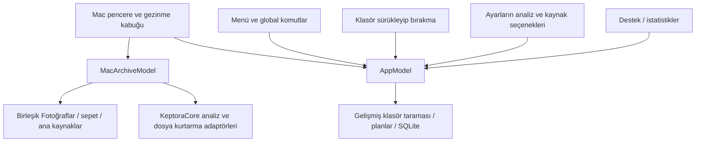

# Profesyonel Mac uygulaması — sistem ve UI/UX mimarisi denetimi

**Tarih:** 5 Ekim 2026. **İncelenen uygulama kodu:** `a34683df8c5237b7c50a6124835ec983c250cf40`, `feat/photo-cleaner-library`.

## Değerlendirme

Profesyonel Mac ürünü için eksikler var. En büyük mimari sorun, aynı kabuğun içinde iki ayrı ürün akışının bulunması: birleşik Fotoğraflar ekranı `MacArchiveModel`, menüler ve gelişmiş araçlar `AppModel` kullanıyor. Ayarlar, komutlar, destek ve işlem yaşam döngüsü ana birleşik akışa tutarlı bağlanmamış. Düğme boyutu düzeltmeleri bu bağlantı sorunlarını çözmüyor.

**21 bulgu:** 1 P0, 11 P1, 9 P2. P0 Apple derlemesini engelleyen kod hatasıdır; P1 temel davranış/güvenilirlik veya yayın öncesi doğrulama önceliğidir; P2 Mac kullanım kalitesi ve bakım iyileştirmesidir. Bulgular kod kanıtı, tetikleyici, kullanıcı etkisi ve önerilen kabul ölçütü ile aşağıda ayrılmıştır. Yarış/kapanma senaryolarının gerçek cihazda gerçekleşme sıklığı ölçülmedi; olası veri kaybı olmuş gibi bir iddia yapılmaz.

Denetim uygulama kodunu değiştirmez. Önceki [düğme yerleşimi çalışması](BUTTON_LAYOUT_AUDIT.md), [UI/UX ve dil teslimi](UI_UX_CLARITY_DELIVERY.md) ve kullanıcının ortak galeri/sepet, kolay toplu seçim ve son cihaz testleri istekleri dikkate alınmıştır. WhatsApp, karşılaştırma, swipe ile seçim veya büyüteç eklemek önerilmez.

## Mevcut güçlü taraflar

- SwiftUI/AppKit kabuğu, PhotoKit/Vision adaptörleri, ortak `SourceAdapter` sözleşmesi ve actor kullanımı uygun bir temel oluşturuyor.
- Birleşik kaynak kataloğu, örtüşen klasörleri tek sayma, kaynak tikleri/rozetleri ve filtre dışında kalan seçimi koruma mevcut.
- Sabit son inceleme listesi, seçim/revizyon denetimleri, önerilen saklama ve koruma kararları mevcut.
- Dosya taşıması öncesinde diske atomik kurtarma manifesti yazılıyor; taşıma sonrası hash kontrolü, geri alma ve üzerine yazmayı engelleyen geri yükleme var. Fotoğraflar sistemin Son Silinenler alanına gidiyor.
- Hash/görsel önbellekleri, küçük resim bellek sınırları, aşamalı sonuçlar ve temkinli kalite ipuçları mevcut. Kalite etiketi otomatik silme emri olarak kullanılmıyor.
- Ana düğmeler ve dar yerleşimler son çalışmada iyileştirildi. Bu rapor bunları eksikmiş gibi tekrar saymıyor.

## Akışların mevcut ayrışması

Kaynak: [kök görünüm](../../Keptora/App/MainRootView.swift#L9), [menü komutları](../../Keptora/App/KeptoraApp.swift#L85), [sürükleyip bırakma](../../Keptora/App/MainRootView.swift#L75). Gelişmiş araçların ayrı olması tek başına hata değildir; ortak kullanıcı eylemlerinin hangi motoru çalıştırdığı belirsiz olduğunda sorun oluşur.

## P0 — önce giderilmeli

### A01 — Apple fotoğraf adaptöründe tanımsız değişken

- **Kanıt:** [PhotoLibrarySourceAdapter.swift:210](../../Packages/KeptoraCore/Sources/KeptoraCore/PhotoLibrarySourceAdapter.swift#L210). `requestImageDataAndOrientation` geri çağrısı `{ data, _, _, info in }` şeklinde; bu kapsamda `image == nil` kontrol ediliyor. `image` bu kapsamda tanımlı değil. Başka bir metodun `{ image, info in }` parametresi buraya taşınmaz.
- **Etki:** Apple adaptörünün tip kontrolü/derlemesi engellenir. Mac ve iPhone ortak paketini etkiler. Sözdizimi kontrolü isim çözümlemesi yapmadığı, Linux paketi bu adaptörü dışladığı için önceki kontroller bunu yakalamadı.
- **Düzeltme/kabul:** Veri geri çağrısında doğru `data`/bulut koşulu kullanılmalı; paket ve iki uygulama Apple SDK ile derlenmeli. Yerel ve yalnızca bulutta bulunan asıllar için gerçek PhotoKit testi geçmeli.
- **Kanıt sınırı:** Bu bir kaynak kapsam hatası tespitidir; bu ortamda Apple derleyici çıktısı üretilmedi.

## P1 — temel ürün ve güvenilirlik eksikleri

### A02 — menü, kısayol ve sürükleme ana galeriden farklı motoru çalıştırıyor

- **Kanıt:** [KeptoraApp.swift:85](../../Keptora/App/KeptoraApp.swift#L85) klasör açma, `⌘R` tarama ve analiz komutlarını `AppModel` üzerinden çalıştırıyor. [MainRootView.swift:75](../../Keptora/App/MainRootView.swift#L75) bırakılan klasörü aynı modele bağlayıp `.home` rotasına gönderiyor. Ana Fotoğraflar ekranı [ayrı `MacArchiveModel`](../../Keptora/App/MainRootView.swift#L9) kullanıyor.
- **Kullanıcı etkisi:** Galerideki “Klasör Ekle” ile `⌘O`/klasör bırakma aynı sonucu üretmiyor. Kullanıcı tek galeriyi beklerken gelişmiş klasör akışına geçebiliyor. “Go” menüsünün adları/sırası da üç ana gezinme öğesiyle uyuşmuyor.
- **Kabul:** Klasör açma/bırakma ve ana tarama tek uygulama komutuna bağlanmalı; aynı kaynak listesi ve galeri güncellenmeli. Gelişmiş komutlar açık isim ve bağlamla ayrılmalı.

### A03 — görünen ayarlar birleşik ana taramaya uygulanmıyor

- **Kanıt:** [SettingsView.swift:51](../../Keptora/Features/Settings/SettingsView.swift#L51) hariç tutma, saklama stratejisi, kalibrasyon ve benzerlik seçenekleri sunuyor. Eski `ScanCoordinator`/`FolderEnumerator` bunları okuyor. Yeni [FolderSourceAdapter](../../Packages/KeptoraCore/Sources/KeptoraCore/FolderSourceAdapter.swift#L43) bu hariç tutma sözleşmesini okumuyor; [LibraryAnalysisCoordinator](../../Packages/KeptoraCore/Sources/KeptoraCore/LibraryAnalysisCoordinator.swift#L54) fotoğraf analizini koşulsuz başlatıyor. `UniversalKeeperPolicy` sabit kurallar, `VisualSimilarityAnalyzer` varsayılan `0.30` eşiği kullanıyor.
- **Kullanıcı etkisi:** Benzerlik kapatılsa veya klasör/uzantı hariç tutulsa bile ana tarama aynı şekilde çalışabiliyor. Arayüzdeki “node_modules her zaman atlanır” açıklaması yeni adaptörde karşılık bulmuyor.
- **Kabul:** Ortak, sürümlü bir analiz/kaynak ayarı snapshot'ı ana koordinatöre geçirilmeli. Her ayarın birleşik taramadaki etkisi test edilmeli; yalnız gelişmiş akışa ait seçenekler ilgili başlık altında açıkça belirtilmeli.

### A04 — uygulamaya dönünce mevcut analiz sonuçları silinebiliyor

- **Kanıt:** [MainRootView.swift:123](../../Keptora/App/MainRootView.swift#L123) her etkinleşmede `refreshPhotosAccess()` çağırıyor. [MacArchiveView.swift:376](../../Keptora/Features/Home/MacArchiveView.swift#L376) kaynak hazırsa izin değişmemiş olsa da `refresh()` çağırıyor; [437. satır](../../Keptora/Features/Home/MacArchiveView.swift#L437) kopya/benzer/kalite sonuçlarını temizliyor.
- **Tetikleyici/etki:** Tarama tamamlandıktan sonra başka uygulamaya geçip geri dönmek; kopya/kalite görünümü boşalabilir ve tekrar tarama gerekir. Seçim korunabilse de kullanıcının analiz bağlamı kaybolur.
- **Kabul:** İzin kontrolü tam yenilemeden ayrılmalı. Değişmeyen öğelerin sonuçları korunmalı; değişen/eklenen/silinen revizyonlar artımlı işlenmeli. Uygulama etkinleşme testi sonuçları koruduğunu göstermeli.

### A05 — “Devam Et” gerçek tarama devamı değil

- **Kanıt:** [MacArchiveView.swift:514](../../Keptora/Features/Home/MacArchiveView.swift#L514) duraklatmayı iptal üzerinden yapıyor; [517. satır](../../Keptora/Features/Home/MacArchiveView.swift#L517) tekrar `analyze()` çağırıyor. Bu metot sonuçları/progresi sıfırlıyor. Ortak koordinatörün [checkpoint parametreleri](../../Packages/KeptoraCore/Sources/KeptoraCore/LibraryAnalysisCoordinator.swift#L42) Mac çağrısına bağlanmamış.
- **Etki:** Önbellek tekrar işi azaltabilir, fakat ilerleme ve oturum baştan başlar. Büyük arşivde düğmenin anlamı kullanıcının beklentisini karşılamaz.
- **Kabul:** Kaynak/revizyon/ayar snapshot'ı doğrulanan kalıcı checkpoint ile devam; uyumsuzluk varsa yeniden başlama nedeni açıkça gösterilmeli.

### A06 — disk ve klasör kimliği mutlak yola bağlı

- **Kanıt:** [FolderSourceAdapter.swift:26](../../Packages/KeptoraCore/Sources/KeptoraCore/FolderSourceAdapter.swift#L26) kaynak ID'sini, [72. satır](../../Packages/KeptoraCore/Sources/KeptoraCore/FolderSourceAdapter.swift#L72) medya ID'sini yoldan üretir. [Kurtarma kaydı yükleme](../../Packages/KeptoraCore/Sources/KeptoraCore/FolderQuarantineExecutor.swift#L125) eski mutlak `sourceRoot` eşitliğini şart koşar. Ana model eski akışın `VolumeIdentity` sözleşmesini kullanmaz.
- **Etki:** Disk/klasör yeniden adlandırılırsa tikler, seçim ve saklama kararları yeni kimliklerle ayrışabilir. Eski manifestler yeni kökte otomatik bulunmayabilir; eski geçmiş kaydı eski yollara geri yüklemeye çalışabilir.
- **Kabul:** Fiziksel volume kimliği, güvenilir dosya kimliği ve kaynak içi göreli yol; bookmark/manifest yol göçü. Disk yeniden bağlama, ad değiştirme ve aynı yola farklı disk takma testleri geçmeli.

### A07 — son inceleme revizyonu ile gerçek işlem arasında doğrulama boşluğu

- **Kanıt:** [MacArchiveView.swift:533](../../Keptora/Features/Home/MacArchiveView.swift#L533) bütün snapshot'ı bir kere doğruluyor; sonra tüm dosya gruplarını hash'liyor; Fotoğraflar kaldırması [553. satırda](../../Keptora/Features/Home/MacArchiveView.swift#L553) yapılıyor. [PhotoKit kaldırma metodu](../../Packages/KeptoraCore/Sources/KeptoraCore/PhotoLibrarySourceAdapter.swift#L426) manuel niyette kimlik/adet kontrolü yapıyor, incelenen revizyonu parametre olarak almıyor.
- **Etki:** Uzun hazırlık sırasında dosya veya Photos öğesi değişirse, inceleme anındaki revizyon ile işlem anındaki içerik ayrışabilir. Dosya taşımasının öncesi/sonrası hash korumaları vardır; bu korumalar sonradan hazırlanan hash'i denetler, tek başına kullanıcı inceleme revizyonunu bağlamaz.
- **Kabul:** Her kaynak işleminin hemen öncesinde incelenen revizyon tekrar doğrulanmalı. Hash hazırlanması revizyon denetimiyle bağlanmalı; değişiklikte işlem durmalı ve yeniden inceleme istenmeli. Hash/preflight sırasında değişiklik enjekte edilen test gerekli. Platform API'si dışında atomik kilit garantisi varmış gibi anlatılmamalı.

### A08 — dosya fotoğraf aileleri ana kaldırma akışında korunmuyor

- **Kanıt:** [SupportedMediaExtensions](../../Packages/KeptoraCore/Sources/KeptoraCore/SupportedMediaExtensions.swift#L23) yan dosyaları ayrı tutuyor; yeni adaptör yalnız `allMedia` tarıyor. Ana `FolderQuarantineExecutor` aile grafiği almıyor. Gelişmiş akışta [RAW+JPEG/Live Photo/yan dosya aileleri](../../Keptora/Core/Families/AssetFamilyGraphBuilder.swift#L33) ve [tamlık denetimi](../../Keptora/Core/Cleanup/QuarantineCoordinator.swift#L58) mevcut.
- **Etki:** Klasörde JPEG/RAW tek başına taşınırken XMP/AAE veya eşleşen hareket bileşeni geride kalabilir. Bu bulgu PhotoKit'in tek bir Live Photo öğesini kaldırması için geçerli değildir.
- **Kabul:** Birleşik dosya akışında aile farkındalığı; bağlantılı bileşenleri gösterme, uygun tam seçim veya anlaşılır uyarı. Kullanıcının bilinçli manuel seçimi ile güvenli öneri politikası ayrı kalmalı.

### A09 — kesilmiş işlemin geçmişi gerçek tamamlanma durumunu taşımıyor

- **Kanıt:** [FolderQuarantineRecord](../../Packages/KeptoraCore/Sources/KeptoraCore/FolderQuarantineExecutor.swift#L17) planlanan operasyonları ve `restoredAt` tutar; işlem bazında durumu tutmaz. Manifest ilk taşıma öncesi yazılır. [Mac yeniden yüklemesi](../../Keptora/Features/Home/MacArchiveView.swift#L443) `record.operations.count` değerini geçmiş adedi yapar. Görünüm “Completed Actions” başlığını kullanır.
- **Etki:** Çöküş veya başarısız rollback sonrasında örneğin 100 planlı dosyanın yalnız 4'ü kurtarma alanındaysa, geçmişin 100 adedi gerçek taşınan sayı olarak anlaşılabilir. Photos adımı da gerçekleşip uygulama geçmişi kaydedilmeden kapanırsa uygulama kayıt zinciri eksik kalabilir; sistem Son Silinenler kurtarması yine vardır.
- **Kabul:** Kaynak/operasyon bazında kalıcı started/moved/restored/failed/interrupted durumu ve diskle hash doğrulamalı uzlaştırma. Geçmişte planlanan, gerçekten taşınan ve bekleyen adetler ayrılmalı.

### A10 — kapanma, kaynak değişikliği ve eşzamanlı işlemlerin sahibi net değil

- **Kanıt:** [AppDelegate](../../Keptora/App/KeptoraApp.swift#L6) ana birleşik iş için kapanma bekletme/flush sözleşmesi sağlamaz; kökün pasifleşme işlemi eski `model.checkpointReviewSession()` üzerindedir. Yeni PhotoKit gözlemcisi `refresh()` çağırır ama loading/analyzing/busy durumunda çağrı atılır; ertelenmiş yenileme kuyruğu yok. [restore()](../../Keptora/Features/Home/MacArchiveView.swift#L575) yalnız `busy` kontrolü yapar, analiz/yükleme ile açık bir çakışma politikası yoktur. Kaynaklar için eski akıştaki mount/unmount gözlemcileri ana modele bağlı değildir.
- **Etki:** İş sürerken gelen değişiklik işaretleri kaybolabilir; tarama sırasında geri yükleme başlatılabilir; kapanma/uyku/disk çıkarma sonrası ana oturumun devamı belirsizdir.
- **Kabul:** Ortak yaşam döngüsü ve kaynak başına işlem kapısı; değişiklikleri biriktiren yenileme; uyku/quit için checkpoint ve güvenli işlem sonlandırma. Başka uygulamaya geçmek taramayı gereksiz durdurmamalı veya sonuçları silmemeli.

### A11 — ana Mac akışının native kabul kanıtı eksik

- **Kanıt:** [Apple CI](../../.github/workflows/apple-validation.yml#L55) Mac UI testlerinden yalnız kaynak izin reddi başlangıç senaryosunu seçiyor. Seçim/son inceleme için Mac unit testleri ve ortak dosya kurtarma testleri var; gerçek birleşik galeri akışının tam UI senaryosu CI'da yok. [2.000/3.000 benchmark](../../Packages/KeptoraCore/Tests/KeptoraCoreTests/NativeAnalysisBenchmarkTests.swift#L14) ortam değişkeni verilmeden atlanıyor; workflow bu değişkeni ayarlamıyor.
- **Etki:** Galeri → kaynaklar → grup/seçim → son inceleme → karışık kaynak kaldırması → geçmiş/geri yükleme zinciri ve menü/klavye eşdeğerliği doğrulanmış sayılmaz. Büyük fotoğraf sayısı testinin olması, gerçek Mac performansı ölçülmüş olduğu anlamına gelmez.
- **Kabul:** Ana Mac E2E fixture + gerçek yerel medya senaryoları; menü ve tıklama eşdeğerliği; etkinleşme/devam/yeniden bağlama/hata senaryoları; periyodik opt-in benchmark ve gerçek kullanıcı corpus'u. Apple derleme ve `.xcresult` kanıtı saklanmalı.

### A20 — geçmişte geri yükleme hatası ve ilerlemesi kullanıcıya ulaşmıyor

- **Kanıt:** [restore() hata yolu](../../Keptora/Features/Home/MacArchiveView.swift#L590) `archive.error` yazar. [MacManualHistoryView](../../Keptora/Features/Home/MacArchiveView.swift#L1120) ve `CombinedCleanupHistoryView` bu hatayı veya `archive.status` ilerlemesini göstermiyor. Kök [alert](../../Keptora/App/MainRootView.swift#L127) farklı `model.isShowingError` durumuna bağlı.
- **Tetikleyici/etki:** Özgün yol dolu, kurtarma dosyası değişmiş veya kaynak erişimi yokken Geçmiş'teki Geri Yükle tıklanır; kullanıcı işlem neden gerçekleşmediğini mevcut ekranda göremez.
- **Kabul:** Tek kök hata/işlem sunucusu veya geçmişe bağlı görünür hata, ilerleme ve yeniden deneme. Etkilenen kayıt, neden ve uygun “Kaynağı yeniden bağla / Finder'da göster” eylemi görünmeli. Üzerine yazmayı engelleyen mevcut koruma korunmalı.

## P2 — profesyonel Mac kullanım ve bakım eksikleri

| ID | Eksik ve kod kanıtı | Kullanıcı etkisi / kabul ölçütü |
|---|---|---|
| **A12** | [Galeri](../../Keptora/Features/Home/MacArchiveView.swift#L880) Button + checkbox hücreleri kullanıyor; odaklanan medya/range-selection sözleşmesi yok. Tek adımlı undo özel modelde, standart `UndoManager` ile bağlanmamış. Uygulamada `Settings` scene/`⌘,` komutu yok. | Ok tuşlarıyla odak, Space ile seçim, Shift aralığı ve standart Edit/Undo bağlamı eklenmeli. `⌘A`/`⌘Z` metin alanı odağıyla test edilmeli. Dosya için Finder'da Göster bağlam eylemi yararlı. Tek ana pencere yeterli; çok pencere eklemek zorunlu değil. |
| **A13** | [Filtreler](../../Keptora/Features/Home/MacArchiveView.swift#L600) view-local `@State`; Mac galeri için scroll/focus geri yükleme sözleşmesi yok. | Geçmiş/Ayarlar'a gidip dönünce kullanıcının kaldığı öğe, filtre ve sıralama korunmalı. Sepetin korunması tek başına çalışma bağlamının korunması değildir. |
| **A14** | [Öneriler rotası](../../Keptora/App/MainRootView.swift#L293) yalnız `.review` ile aynı galeriyi açıyor. [.review filtresi](../../Packages/KeptoraCore/Sources/KeptoraCore/AnalysisModels.swift#L155) kalite bulgularını ve sıradan benzerleri kapsıyor; normal kaliteli kopyalar/çok benzerler bu filtreye otomatik girmez. | Öneriler altında kopyalar, çok benzerler ve kalite kategorileri adetli ve anlaşılır bulunmalı; aynı galeri ve sepeti kullanmalı. Boş kategori ile henüz analiz edilmemiş kategori ayrılmalı. |
| **A15** | [Mac öneri seçimi](../../Keptora/Features/Home/MacArchiveView.swift#L277) erişim politikası almıyor; [iPhone eşdeğeri](../../KeptoraiOS/App/MobileKeptoraStore.swift#L507) `authorizeReview` ile 100 sınırını uyguluyor. | Aynı Pro açıklamasının platformlarda farklı davranması giderilmeli. Manuel seçim/kurtarma ücretsiz kalabilir; ücretli öneri aksiyonlarının sınırı tek sözleşmeyle uygulanmalı ve test edilmeli. |
| **A16** | [Destek göstergeleri](../../Keptora/Features/Diagnostics/DiagnosticsView.swift#L37), performans ve istatistikler eski `AppModel` üzerinde; ana model [`.metrics` güncellemelerini yok sayıyor](../../Keptora/Features/Home/MacArchiveView.swift#L501). | Ana galeri taraması çalışırken Destek başka taramanın/boş veritabanının durumunu gösterebilir. Kaynak kapsamı, aşama, cache hit, atlanan öğeler, son hata ve kurtarma sorunları aktif ortak oturumdan beslenmeli. |
| **A17** | Seçim ID'leri UserDefaults, ayrıntıları ayrı JSON, kararlar/geçmiş başka UserDefaults anahtarlarında. [Seçim kaydı](../../Keptora/Features/Home/MacArchiveView.swift#L237) yazma hatasını `try?` ile yutar; [arşiv yükleme](../../Packages/KeptoraCore/Sources/KeptoraCore/AnalysisModels.swift#L131) bozuk/eksik kaydı boş listeye çevirir. | Tek sürümlü repository ve uyumlu snapshot/transaction; bozuk kayıt için kurtarılabilir yedek/uyarı; kapanmada flush. Önbellek hatasıyla kullanıcı kararı/geçmiş kaydı hatası aynı şekilde ele alınmamalı. |
| **A18** | `MacArchiveView.swift` 1.171 satırda görünüm, kaynak/bookmark, tarama, seçim, kaldırma ve geçmişi birleştiriyor. `AppModel` 1.246, iPhone store 1.458 satır. Ana model adaptörleri ve standart UserDefaults'ı doğrudan kuruyor. [Eski teknik tasarım](../TECHNICAL_DESIGN.md) “Photos deletion is not wired” diyor; güncel akış kaldırma yapıyor. | Satır sayısı tek başına kusur değildir; burada yan etkiler ve bağımlılıklar sıkı bağlı. Kaynak, analiz, seçim, kaldırma, repository ve Mac sunumu ayrılmalı; bağımlılıklar testte değiştirilebilir olmalı. Tek güncel mimari haritası ve kullanımda olmayan modül envanteri tutulmalı. |
| **A19** | 20 Mac App/Features Swift dosyasında boş string hariç **47 sabit metin anahtarında** TR/FR/DE eksik çeviri adayı bulundu. Örnek: [“Go” menüsü](../../Keptora/App/KeptoraApp.swift#L132) üç dilde eksik; [Pro açıklaması](../../Keptora/Features/Paywall/PaywallView.swift#L46) FR/DE eksik. [Mac seçim ipucu](../../Keptora/Features/Home/MacArchiveView.swift#L898) “Tap” diyor. | Ana galeri sabit metinleri önceki taramada tamamlanmıştı; menü/gelişmiş ekranlar tamamı değildir. Adaylar erişilebilir ekranlara göre doğrulanmalı, platform dili düzeltmeli. VoiceOver odak sırası, seçili/kopya/kalite durumunun duyurulması ve artırılmış kontrast gerçek Mac'te kabul edilmeli. |
| **A21** | [Dosya geçmişi](../../Keptora/Features/Home/MacArchiveView.swift#L1134) kurtarma hedefi ve geri yükleme sunuyor; kaydın byte miktarını, toplam kurtarma depolamasını veya kurtarma klasörünü açma eylemini sunmuyor. Aynı volume'a taşıma alan boşaltmıyor. | Uzun süre kullanılan temizleme uygulamasında biriken kurtarma alanı anlaşılır yönetilmeli. Toplam boyut, saklama açıklaması ve Finder'da Göster gerekli. Kalıcı silme politikası ayrı ürün kararıdır; otomatik silme önerilmez. Photos Son Silinenler'in sistem tarafından yönetildiği açık kalmalı. |

**A19 ölçüm sınırı:** Regex taraması yalnız sabit literal anahtarları denetler; interpolasyonlar ve dinamik metinleri kapsamaz. Bazı adaylar eski/ulaşılmayan PhotoViewer görünümlerindedir. 47 sayısı “kullanıcının gördüğü 47 bozuk metin” veya tüm yerelleştirme denetimi olarak yorumlanamaz. Ana menü ve Pro örnekleri doğrudan kullanılan ekranlardan doğrulandı.

## Cihazda ölçülmesi gereken iki konu

1. **Etkileşim, bellek ve enerji:** [visible projeksiyonu](../../Keptora/Features/Home/MacArchiveView.swift#L613), `scopedAssets`, grup/rozet hazırlığı ve özetler ana actor üzerinde view güncellemelerinde tekrar hesaplanıyor. FotoKit tek görüntü hash yolu [tam Data](../../Packages/KeptoraCore/Sources/KeptoraCore/PhotoLibrarySourceAdapter.swift#L197) alıyor. Küçük resim önbellekleri ve dosya streaming hash'i mevcut; bunların yok olduğu iddia edilmez. 2.000/3.000 gerçek JPEG/HEIC/RAW/video ile ilk kullanılabilir sonuç, etkileşim p95, tepe bellek, soğuk/sıcak tarama, iptal süresi, ısı/enerji ölçülmeli. Sonuca göre projeksiyon önbelleği, kısa arama debounce'u, daha dar observation sınırları ve Photos kaynak streaming'i seçilmeli. Şu anda ölçülmüş bir FPS/bellek problemi ilan edilmez.
2. **Benzerlik ve kalite doğruluğu:** Ana yeni analiz, gelişmiş kalibrasyon modelinin eşiklerini kullanmıyor. [VisualSimilarityAnalyzer](../../Packages/KeptoraCore/Sources/KeptoraCore/VisualSimilarityAnalyzer.swift#L13) ve [QualityAssessment](../../Packages/KeptoraCore/Sources/KeptoraCore/QualityAssessment.swift#L36) gerçek etiketli örneklerle ölçülmeli. Portre/bokeh, gece, belge/ekran görüntüsü, düşük çözünürlük ve bilinçli hareket ayrı değerlendirilmelidir. “Muhtemelen bulanık” etiketi kesin kalite hükmüne dönüştürülmemeli. Zaman/konum yardımcı kanıt olarak kalmalı; görsel eşleşmenin yerine geçmemeli.

## Önerilen mimari hedefi

Mevcut SwiftUI/AppKit/PhotoKit/Vision temelini koruyarak ortak akış kurulabilir; tüm uygulamayı yeniden yazmak gerekmez.

| Katman | Sahip olduğu iş | Kullanıcıya sonucu |
|---|---|---|
| **AppSession / Composition Root** | Tek ortak servis kurulumu, aktif oturum, menü, pencere, drop ve yaşam döngüsü | Aynı işlem her giriş noktasında aynı kaynağı/galeriyi açar. |
| **LibraryRepository** | Kaynak/volume kimliği, sürümlü seçim/karar/geçmiş kayıtları, ayar snapshot'ı | Yeniden açma/yeniden bağlamada çalışma korunur. |
| **SourceAccessCoordinator** | PhotoKit yetkisi, bookmark yenileme, dosya sağlayıcı ve volume erişimi | Kaynakların gerçekten erişilebilir durumu görünür. |
| **AnalysisSession** | Artımlı analiz, checkpoint, ayar uygulama, cache ve ölçümler | Devam et devam eder; değişmeyen sonuç kaybolmaz. |
| **SelectionSession + ViewContext** | Ortak sepet, keeper/protection, tek adımlı geri alma, filtre/scroll/odak | Binlerce fotoğrafta çalışma bağlamı ve seçim kolaydır. |
| **CleanupCoordinator + OperationLedger** | Sabit inceleme, kaynak başına revizyon/aile kontrolü, gerçek işlem durumları, uzlaştırma | Yarım kalan işlem anlaşılır; kurtarma güvenilir ve görünürdür. |
| **Mac Presentation / Commands** | Native gezinme, klavye odağı, hata/ilerleme sunumu, erişilebilirlik | Kullanıcı teknik katmanları anlamadan uygulamayı kullanır. |

## Uygulama sırası ve kabul kapıları

| Sıra | Çalışma | Tamamlanma kanıtı |
|---|---|---|
| **1 — Çalışan temel** | A01; menü/drop/ayar ve ortak hata/ilerleme bağlantısı | Apple derleme, `⌘O`/drop/buton eşdeğerliği, ayar etkisi ve Geçmiş hata senaryosu. |
| **2 — Oturum ve güvenlik** | A04–A10; kaynak kimliği, checkpoint, geç revizyon kontrolü, aile ve işlem günlüğü | Etkinleşme sonucu korur; duraklat/devam gerçek devam; yeniden bağlama ve işlem ortasında değişiklik/çöküş testleri geçer. |
| **3 — Mac çalışma kalitesi** | A12–A19, A21 | Klavye/range seçimi, native ayarlar, filtre/odak dönüşü, öneri kategorileri, Pro eşdeğerliği, destek verisi ve dil kabulü. |
| **4 — Son cihaz kabulü** | A11 ve iki ölçüm alanı | Küçük/dar pencere, VoiceOver, gerçek 2.000/3.000 medya, bulut ve harici disk; native test/screenshot/ölçüm artefaktları. |

Kullanıcının istediği şekilde GitHub'da kod, test fixture'ları ve otomasyon önce hazırlanabilir. Xcode, gerçek Mac/iPhone ve insan görsel/kalite kabulü son aşamada kalır; derleme engeli son aşamaya ertelenmez, kaynak kodunda önce giderilir.

## Bu denetimin doğrulaması

- 54 taşınabilir `KeptoraCore` XCTest senaryosu Linux Swift 6.0.3 ile tekrar çalıştırıldı, çıkış kodu 0. Kaynak kapsamı, seçim, koruma, kalite politikası ve cache sözleşmelerini kapsar.
- Linux paketi Apple kaynaklarını bilinçli dışlar; bu test sonucu A01'i geçersiz kılmaz ve Apple adaptörlerinin derlendiğini göstermez.
- Kaynak çağrı zincirleri, ayar okuyucuları, işlemlerin hata yolları, test/CI seçimi ve sabit metin kataloğu incelendi.
- Bu ortamda Apple SDK derlemesi, gerçek UI yürütmesi, Instruments, VoiceOver veya yeni ekranların görsel kabulü yapılmadı. Önceki raporlardaki eski faz/release başlıkları güncel doğrulama kanıtı sayılmadı.
